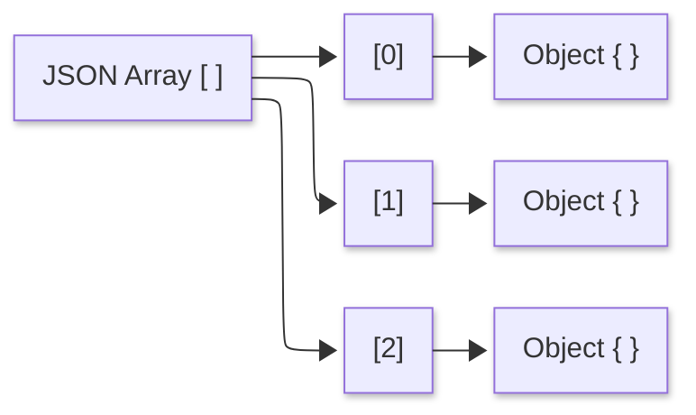
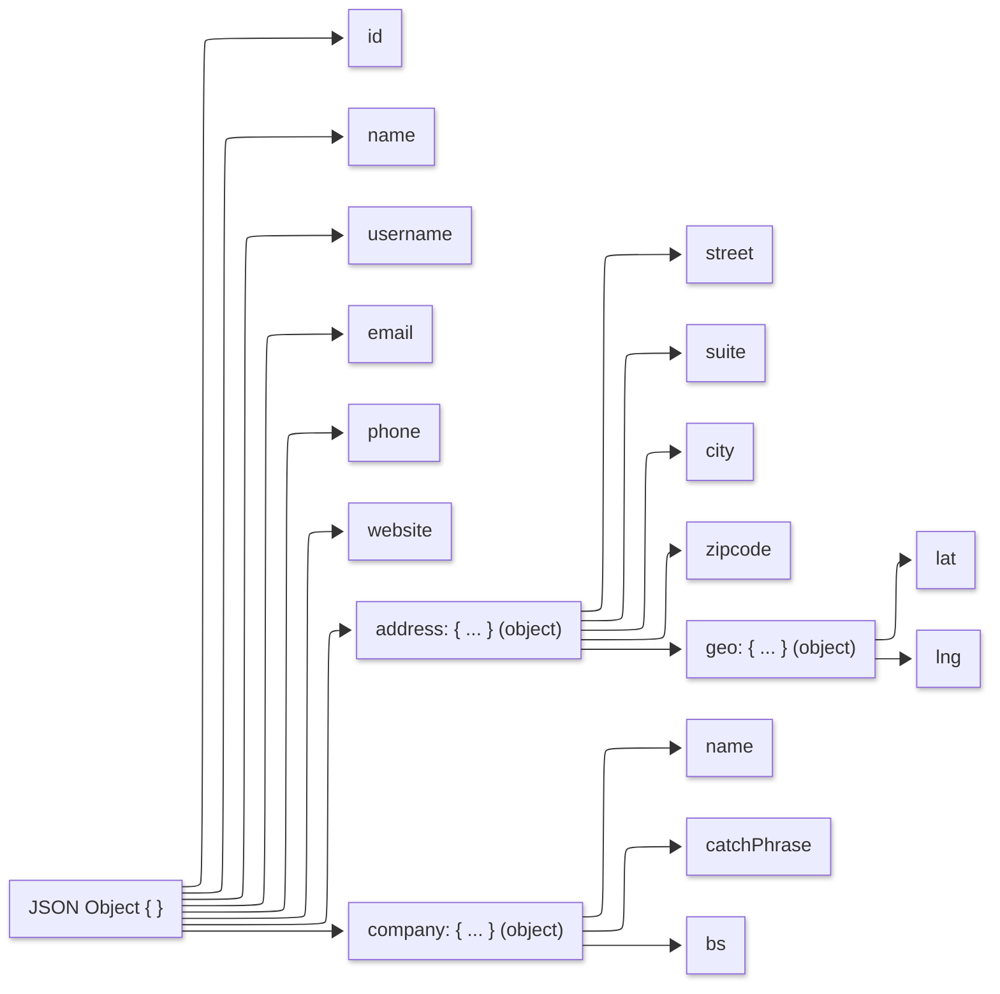

## Introduction

The goal of this task is to treat a malformed JSON document, explain errors in terms of the JSON grammar, and produce a corrected, well-formed version. We take a layered, testable approach: first validate syntax, then show evidence.

1. [Validation](#validation)
2. [Exercise Details](#exercise-details)
3. [JSON Grammar](#json-grammar)
4. [Why it matters](#why-it-matters)

## Validation

### Syntax (well-formed JSON)

Syntax checking for well-formed JSON refers to bytes that conform exactly to the JSON grammar so a parser can build a single, unambiguous parse tree. A well-formed document has exactly one top-level value, either an object or array; objects use curly braces with double-quoted string keys and colon-separated values; arrays use brackets with comma-separated elements.

A common approach is to use `Linting` to ensure JSON is well-formed before any deeper checks. The main drawback with this approach is that syntax-validation tools tend to report only the first syntax error it encounters. Thus, a validation effort may require a number of iterations and human oversight.

#### Common tools

  `jq` is a lightweight command-line JSON processor that doubles as a fast, strict syntax checker—perfect for linting. It parses input according to the JSON grammar specification, fails on malformed documents, and can pretty-print or normalize output for review. A simple invocation like `jq -e . data/jdoc_original.json` returns a non-zero exit code and an error message (with line and column) when the JSON isn’t well-formed, making it easy to gate builds on valid syntax.

  ```bash
  jq -e . data/jdoc_original.json
  jq: parse error: ':' not as part of an object at line 3, column 13
  ```

#### CI Helpers

For schema or semantic checks, we can combine `jq` with a JSON Schema validator in CI. For instance, in this exercise, we applied GitHub Action for [Super-linter](https://github.com/super-linter/super-linter). This package integrates multiple language linters, including support for JSON, into a unified CI check. It operates on every push and pull request.

In this exercise, Super-linter runs on every push/PR and focuses only on `tasks/task1-jsonfix/data/**/*.json` (via `VALIDATE_JSON` and `FILTER_REGEX_INCLUDE`). It parses those files with its JSON linters, reports line/column errors in the job log, and fails the check if any file is not well-formed—giving you an automatic, visible gate in CI before code review.

These are the results of a typical check:

```bash
156  2025-09-13 02:27:22 [INFO]   Linting JSON items...
157  Error: -13 02:27:25 [ERROR]   Found errors when linting JSON. Exit code: 1.
158  2025-09-13 02:27:25 [INFO]   Command output for JSON:
159  ------
160  
161  /github/workspace/tasks/task1-jsonfix/data/jdoc_original.json
162    3:13  error  Parsing error: Unexpected token ':'
163  
164  ✖ 1 problem (1 error, 0 warnings)
```
<br>
This is the summary generated at run-time:

  **Super-linter summary**

  | Language | Validation result |
  | -------- | ----------------- |
  | JSON     | Fail ❌           |

Super-linter detected linting errors


### Structural validation (schema/shape)

Structural validation (schema/shape) checks that a JSON document has the right fields and types. Through a validation policy, we assert a contract for the required properties, allowed types/enums, string patterns, numeric ranges, array lengths, and nested object shapes, and reject payloads that don’t conform. 

The standard approach is to use JSON Schema, which is validated with tools such as AJV, python-jsonschema, or gojsonschema. In strongly typed loaders, we enforce shape by decoding into typed structs and enabling strict options, rejecting unknown fields, and catching mismatches early.

This is outside of the scope of this task, but it is relevant for context.

### Robustness & security checks

Robustness and security checks extend beyond mere syntax and structure to mitigate risks posed by malicious or malformed inputs. In this context, we look to implement size and depth constraints to defend against Denial-of-Service attacks stemming from oversized payloads or excessive nesting. 

Our programs should reject duplicate keys to counteract differential parsing exploits, mandate UTF-8 encoding with valid escape sequences, and maintain numeric precision for identifiers and monetary values. With this approach, we look to enforce a fail-fast strategy for unknown fields to prevent the silent acceptance of potentially harmful data.

This concept is also is outside of the scope of this task, but it is relevant for completeness.

## Exercise Details

The document presents an array of three objects with two syntax errors in the document structure. 

* After the data array opening with `[` symbol, the first object is missing a curly brace `{` before the first `"id"` key. 

    The snippet shown below shows the first object in the original file - [See lines 1–24 of jdoc_original.json](https://github.com/gcastill0/go-integration-playground/blob/main/tasks/task1-jsonfix/data/jdoc_original.json#L1-L24). Note specifically that the first object is missing the opening handlebar ('{') which should be located in line 2.

    ```json
    01  [
    02    
    03      "id": 1,
    04      "name": "Leanne Graham",
    05      "username": "Bret",
    06      "email": "Sincere@april.biz",
    07      "address": {
    08          "street": "Kulas Light",
    09          "suite": "Apt. 556",
    10          "city": "Gwenborough",
    11          "zipcode": "92998-3874",
    12          "geo": {
    13              "lat": "-37.3159",
    14              "lng": "81.1496"
    15          }
    16      },
    17      "phone": "1-770-736-8031 x56442",
    18      "website": "hildegard.org",
    19      "company": {
    20          "name": "Romaguera-Crona",
    21          "catchPhrase": "Multi-layered client-server neural-net",
    22            "bs": "harness real-time e-markets"
    23        }
    24    },
    ```

<br>

* The data structure never closes the array with a `]` symbol after the third object; the file moves on to the closing curly brace `}`.

    The following snippet shows the last object in the dictionrary from original file - [See lines 48–71 of jdoc_original.json](https://github.com/gcastill0/go-integration-playground/blob/main/tasks/task1-jsonfix/data/jdoc_original.json#L48-L71). Note specifically that the array is missing the closing bracker (']') which should be located in line 71.

    ```json
    48    {
    49    "id": 3,
    50   "name": "Clementine Bauch",
    51    "username": "Samantha",
    52    "email": "Nathan@yesenia.net",
    53    "address": {
    54      "street": "Douglas Extension",
    55        "suite": "Suite 847",
    56        "city": "McKenziehaven",
    57        "zipcode": "59590-4157",
    58        "geo": {
    59            "lat": "-68.6102",
    60            "lng": "-47.0653"
    61        }
    62    },
    63    "phone": "1-463-123-4447",
    64    "website": "ramiro.info",
    65    "company": {
    66        "name": "Romaguera-Jacobson",
    67        "catchPhrase": "Face to face bifurcated interface",
    68        "bs": "e-enable strategic applications"
    69    }
    70  }
    71
    ```

<br>

## Fixes

There are two minimal fixes: 

1. insert a left handle bar `{` on line 2, right after the opening `[`, and 

2. add the closing right bracker, `]`, at the end of the array on line 71.

<br>

## JSON Grammar

With JSON, there two primary composite components: objects and arrays.

### Arrays

An array is an ordered sequence of values. It is delimited by a left bracket “[” and a right bracket “]”. Elements are separated by commas, and each element may be any JSON value, including strings, numbers, booleans, null, objects, or other arrays. Order is semantically meaningful: consumers interpret elements by their position in the sequence. 

In this exercise, the data structure encloses all objects in a single array as follows:



While JSON does not define indices, most programming languages expose arrays with zero-based indexing, so the first element is at index 0, the second at index 1, and so on. Arrays may be empty. Trailing commas are not permitted, and JSON does not support “holes”; every position must contain a value, so an absent value must be represented explicitly, for example with null.

### Objects

An object is an unordered mapping from string keys to values. It is written between a left curly brace “{” and a right curly brace “}”. Each member consists of a double-quoted key, a colon, and a value, and members are separated by commas. Values may be any JSON value (string, number, boolean, null, array, or another object).

To illustrate, the following is a representation of the object structure from the original JSON document.



The order of members has no semantic meaning; you retrieve information by key, as with a dictionary or hash map. Keys should be unique because the standard does not define behavior for duplicates, and trailing commas after the final member are not permitted.


## Why it matters

When we write a program to "unmarshal" JSON data, we begin by parsing the text using established grammar, and then mapping the parsed structure into data types. If the text does not adhere to the correct grammar, the parser is unable to construct a valid structure, rendering the mapping step ineffective due to a lack of reliable information.

Proper grammar is essential because a program can only convert bytes into data if those bytes conform to a language it recognizes. In this context, JSON's grammar serves as that language.

Here are the top three considerations:

* **Deterministic structure**

  Proper JSON grammar guarantees a single, unambiguous parse tree. Parsers know exactly where objects, arrays, and values begin and end, which is the prerequisite for any reliable deserialization.

* **Correct type mapping and interoperability**

  Once the structure is unambiguous, values can be mapped to program types consistently across languages and libraries. Strict grammar prevents “works on my machine” bugs caused by lenient features, such as unquoted keys or trailing commas.

* **Security and robustness**

  Ambiguous or invalid syntax opens parsing discrepancies that attackers can exploit. Enforcing grammar closes those gaps and reduces deserialization pitfalls. For instance, if one component is lenient (accepts comments, trailing commas, or duplicate keys) while another is strict, the same payload can be interpreted differently across layers (e.g., gateway vs app). Attackers abuse this to bypass checks. A classic pattern is duplicate keys where a security filter reads the first `"role": "user"` but the application’s parser keeps the last occurrence `"role": "admin"`, resulting in privilege escalation. 

## Conclusion

In this task we treated JSON correctness as a small, testable pipeline: parse first, then prove it. By validating syntax with command-line tools like `jq` and wiring Super-linter to gate every push and pull request, we ensure that malformed documents never make it past review. We then documented the exact grammar violations and demonstrated the minimal, targeted fixes needed to restore a well-formed structure.

<br>
<br>

---
Code: Apache License © 2025 see [LICENSE](/LICENSE).
This README and notes: CC BY 4.0 © 2025 G Castillo.