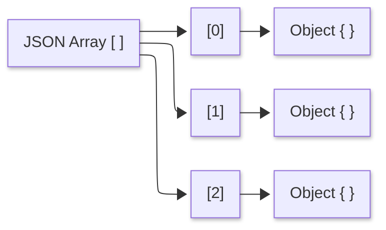
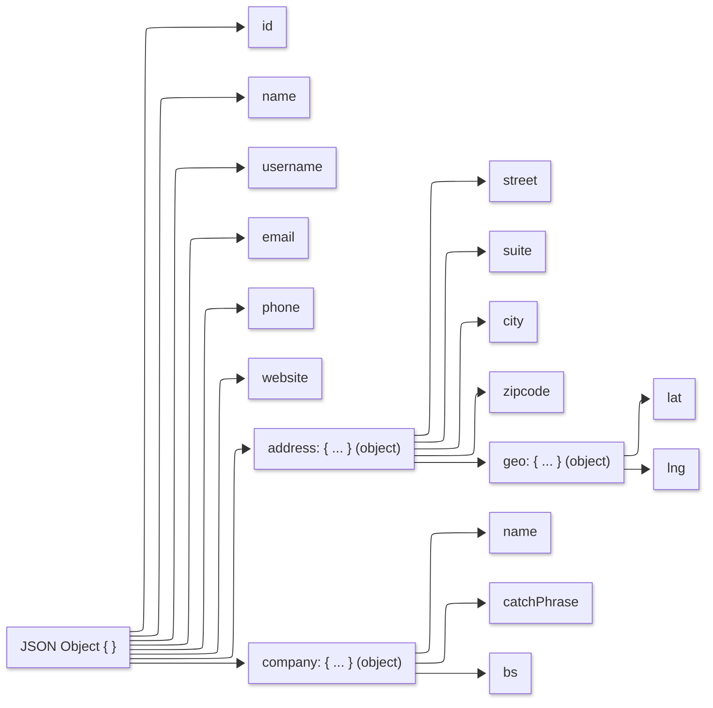

## Details

The document present an array of three objects with two syntax errors in the document structure. 

* After the data array opening with `[` symbol, the first object is missing a `{` before the first `"id"` key. 

    The snippet shown below shows the first object in the original file - [See lines 1–24 of jdoc_original.json](https://github.com/gcastill0/go-integration-playground/blob/main/tasks/task1-jsonfix/data/jdoc_original.json#L1-L24). Note specifically that the first object is missing the opening handlebar ('{') which should be located in line 2.

    ```json
    01  [
    02    
    03      "id": 1,
    04      "name": "Leanne Graham",
    05      "username": "Bret",
    06      "email": "Sincere@april.biz",
    07      "address": {
    08          "street": "Kulas Light",
    09          "suite": "Apt. 556",
    10          "city": "Gwenborough",
    11          "zipcode": "92998-3874",
    12          "geo": {
    13              "lat": "-37.3159",
    14              "lng": "81.1496"
    15          }
    16      },
    17      "phone": "1-770-736-8031 x56442",
    18      "website": "hildegard.org",
    19      "company": {
    20          "name": "Romaguera-Crona",
    21          "catchPhrase": "Multi-layered client-server neural-net",
    22            "bs": "harness real-time e-markets"
    23        }
    24    },
    ```

<br>

* The data structure never closes the array with a `]` symbol after the third object; the file moves on to the final `}`.

    The following snippet shows the last object in the dictionrary from original file - [See lines 48–71 of jdoc_original.json](https://github.com/gcastill0/go-integration-playground/blob/main/tasks/task1-jsonfix/data/jdoc_original.json#L48-L71). Note specifically that the array is missing the closing bracker (']') which should be located in line 71.

    ```json
    48    {
    49    "id": 3,
    50   "name": "Clementine Bauch",
    51    "username": "Samantha",
    52    "email": "Nathan@yesenia.net",
    53    "address": {
    54      "street": "Douglas Extension",
    55        "suite": "Suite 847",
    56        "city": "McKenziehaven",
    57        "zipcode": "59590-4157",
    58        "geo": {
    59            "lat": "-68.6102",
    60            "lng": "-47.0653"
    61        }
    62    },
    63    "phone": "1-463-123-4447",
    64    "website": "ramiro.info",
    65    "company": {
    66        "name": "Romaguera-Jacobson",
    67        "catchPhrase": "Face to face bifurcated interface",
    68        "bs": "e-enable strategic applications"
    69    }
    70  }
    71
    ```

<br>

## Fixes

There are two the minimal fixes: 

1. insert a left handle bar `{` on line 2, right after the opening `[`, and 

2. add the closing right bracker, `]`, at the end of the array on line 71.

<br>

## JSON Grammar

With JSON, there two primary composite components: objects and arrays.

### Arrays

An array is an ordered sequence of values. It is delimited by a left bracket “[[]” and a right bracket “[]”. Elements are separated by commas, and each element may be any JSON value, including strings, numbers, booleans, null, objects, or other arrays. Order is semantically meaningful: consumers interpret elements by their position in the sequence. 

In this exercise, the data structure encloses all objects in a single array as follows:



While JSON does not define indices, most programming languages expose arrays with zero-based indexing, so the first element is at index 0, the second at index 1, and so on. Arrays may be empty. Trailing commas are not permitted, and JSON does not support “holes”; every position must contain a value, so an absent value must be represented explicitly, for example with null.

### Objects

An object is an unordered mapping from string keys to values. It is written between a left curly brace “{” and a right curly brace “}”. Each member consists of a double-quoted key, a colon, and a value, and members are separated by commas. Values may be any JSON value (string, number, boolean, null, array, or another object).

To illustrate, the following is a representation of the object structure from the origianl JSON document.



The order of members has no semantic meaning; you retrieve information by key, as with a dictionary or hash map. Keys should be unique because the standard does not define behavior for duplicates, and trailing commas after the final member are not permitted.


