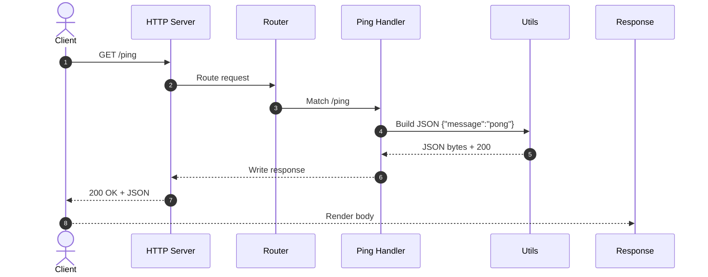
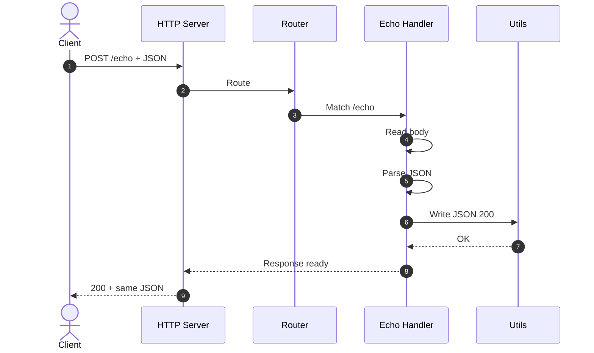

# Task 2 — HTTP Server

This task implements a small HTTP server in Go that listens on port 8080 and exposes two endpoints for quick integration checks. The goal is to demonstrate a clean request and response flow using JSON, along with a minimal set of helper functions collected under a `utils` package to keep handlers focused. The implementation passes the included unit tests and is wired to run successfully in GitHub Actions.

This project also includes a custom service extension that demonstrates how headers can be added and logic injected into request handling. The extension is not required for the basic HTTP server to function; rather, it is included as part of the assessment to show how Go code can be structured to extend or enrich an orchestrator. Its purpose here is purely self-educational, giving a safe and contained way to practice writing integration logic. By treating it as a learning tool, you can experiment with how the extension interacts with requests and headers without risk to production systems.

Quick estimates for reading:

| Reading mode           | Estimate        |
| ---------------------- | --------------- |
| Fast skim              | \~4–6 minutes   |
| Typical technical read | \~6–10 minutes  |
| Careful read           | \~10–15 minutes |

## What this service does

The server responds to a health-style probe at `/ping` with a JSON message indicating the service is reachable, and it echoes any JSON document posted to `/echo` back to the caller. The `utils` package centralizes common HTTP concerns such as writing JSON responses, applying headers, and uniform error payloads, which keeps the endpoint handlers concise and predictable. The end-to-end behavior matches the assessment’s expected outputs.

### GET Verb, `/ping` Endpoint

The HTTP verb GET is used by a client to request information from a server without modifying any data. It is safe and idempotent, meaning repeated calls should always return the same result without side effects. In this task, the /ping endpoint serves as a simple health check. When the client sends a GET request to /ping, the server responds with a lightweight JSON message {"message":"pong"}. 

This exchange confirms that the server is up, reachable, and able to process requests, making it a quick diagnostic tool before deeper interactions. 



### POST Verb, `/echo` Endpoint

The HTTP verb POST sends data from the client to the server to be processed. It is not idempotent and is typically used to create or submit content in the request body. In this task, the /echo endpoint accepts a JSON payload and returns the same JSON back to the caller. This confirms that the server can read the body, parse JSON, and write a correct JSON response, making it a simple round-trip integrity check before more complex interactions.



## Requirements

You need a recent Go toolchain (Go 1.22 or newer is sufficient). No external services are required to run or test this task locally. The repository already includes everything needed to run the server, its tests, and the GitHub Actions workflow that validates the build and tests in CI.

## How to run the server

From the repository root, start the server with a standard `go run` invocation pointing to the task’s main package. If the task is laid out as a package directory with a `main.go`, you can start it like this:

```
go run ./tasks/task2-httpserver
```

Once running, the server listens on `127.0.0.1:8080`.

## How to verify the endpoints

You can verify the `GET /ping` endpoint by calling it from another shell. A successful response returns a small JSON object with a message confirming liveness.

```
curl -s http://127.0.0.1:8080/ping
```

You can verify the `POST /echo` endpoint by posting any JSON body to it. The server returns the same payload in the response body, confirming the request parsing and JSON round trip.

```
curl -s -X POST http://127.0.0.1:8080/echo -H "Content-Type: application/json" -d '{"name":"test"}'
```

## About the utils package

The `utils` folder under `tasks/task2-httpserver/utils` contains the reusable building blocks the handlers depend on. These typically include helpers to marshal and write JSON with the correct content type, helpers to write errors in a consistent JSON format, and small conveniences for header management or input validation. By placing this logic in a separate package, the handlers for `/ping` and `/echo` remain straightforward and easy to read, while the utilities provide a single source of truth for response formatting.

## How to run the tests

The tests for this task are written as Bash scripts. The test scripts start by launching the 2 HTTP server and waiting until it is listening on port 8080, ensuring the service is ready to accept requests. Once the HTTP service is running, the test invokes the running server with `curl`, assert HTTP status codes and JSON bodies, and returns non-zero exit codes on failure so they integrate cleanly with `go test` wrappers or GitHub Actions. This approach keeps dependencies minimal, runs on any POSIX shell in CI, and verifies the two behaviors end to end: `GET /ping` must return a 200 with `{"message":"pong"}`, and `POST /echo` must return a 200 with the exact JSON payload sent.

**`tests/task2_httpserver_base.bash`** is the common harness that prepares and controls the test environment. It typically builds or launches the HTTP server for Task 2, waits until port 8080 is accepting connections, exports any needed variables, and sets traps to cleanly stop the server on exit. It also provides small helper functions (for curling endpoints, asserting status codes, and comparing JSON) so the specific test scripts can focus on behavior rather than setup.

```bash
bash tests/task2_httpserver_base.bash
```

```bash
*   Trying 127.0.0.1:8080...
* Connected to 127.0.0.1 (127.0.0.1) port 8080
> GET / HTTP/1.1
> Host: 127.0.0.1:8080
> User-Agent: curl/8.7.1
> Accept: */*
> 
* Request completely sent off
< HTTP/1.1 200 OK
< Date: Mon, 15 Sep 2025 19:40:38 GMT
< Content-Length: 13
< Content-Type: text/plain; charset=utf-8
< 
{ [13 bytes data]
* Connection #0 to host 127.0.0.1 left intact

OK: / returned 200 and response "Hello, world"
```

**`tests/task2_httpserver_ping.bash`** verifies the health-check behavior of the GET endpoint. It uses the base harness to ensure the server is running, then issues a GET request to /ping with curl, asserts an HTTP 200 status, and compares the body to the exact JSON payload expected for liveness, typically {"message":"pong"}. If either the status or body diverges, the script exits non-zero to signal failure to CI.

```bash
bash tests/task2_httpserver_ping.bash
```

```bash
*   Trying 127.0.0.1:8080...
* Connected to 127.0.0.1 (127.0.0.1) port 8080
> GET /ping HTTP/1.1
> Host: 127.0.0.1:8080
> User-Agent: curl/8.7.1
> Accept: */*
> 
* Request completely sent off
< HTTP/1.1 200 OK
< Content-Type: application/json
< Date: Mon, 15 Sep 2025 19:42:38 GMT
< Content-Length: 18
< 
{ [18 bytes data]
* Connection #0 to host 127.0.0.1 left intact

OK: /ping returned 200 and response "{"message":"pong"}"
```

**`tests/task2_httpserver_echo.bash`** validates the JSON round-trip behavior of the POST endpoint. After the base script ensures the server is ready, it posts a small JSON document to /echo with the appropriate content type, expects an HTTP 200, and asserts that the response body matches the request body byte-for-byte. Any mismatch results in a non-zero exit so the failure is visible locally and in GitHub Actions.


```bash
bash tests/task2_httpserver_ping.bash
```

```bash
*   Trying 127.0.0.1:8080...
* Connected to 127.0.0.1 (127.0.0.1) port 8080
> POST /echo HTTP/1.1
> Host: 127.0.0.1:8080
> User-Agent: curl/8.7.1
> Accept: */*
> Content-Type: application/json
> Content-Length: 15
> 
} [15 bytes data]
* upload completely sent off: 15 bytes
< HTTP/1.1 200 OK
< Content-Type: application/json
< Date: Mon, 15 Sep 2025 19:44:24 GMT
< Content-Length: 15
< 
{ [15 bytes data]
* Connection #0 to host 127.0.0.1 left intact

OK: /echo returned 200 and response "{"name":"test"}"
```

## GitHub Actions

In this project, GitHub Actions is configured to run against the Go source directory so that every push or pull request automatically triggers a workflow. The workflow checks out the code, sets up Go, builds the project if required, and then executes the Bash test scripts that launch the HTTP server and verify its endpoints with `curl`. 

In GitHub Actions, the workflow checks out the repository, sets up a Go toolchain, and then invokes the Bash testing scripts as part of the CI job. The scripts launch the Task 2 HTTP server, wait for it to listen on port 8080, and use curl to exercise `GET /ping` and `POST /echo`, failing the job if any assertion or exit code is non-zero. Because the tests are plain shell scripts, they run consistently on the hosted Linux runners without extra dependencies, providing fast, end-to-end verification of the server’s behavior on every push and pull request.

After a run completes, GitHub Actions produces a summary page attached to the commit or pull request. That page shows whether the job succeeded or failed, the exact steps that were executed, and the logs from each test script. This makes it easy to confirm that the `/ping` and `/echo` endpoints behaved correctly and to quickly diagnose any issues introduced by a change.

### Task 2 HTTP Server — Test Summary

| Test | Result |
|------|--------|
| Base `/` | **OK: / returned 200 and response Hello, world** |
| GET /ping | **OK: /ping returned 200 and response {message:pong}** |
| POST /echo | **OK: /echo returned 200 and response {name:test}** |

<details><summary>Base HTTP Service</summary>

```text
*   Trying 127.0.0.1:8080...
* Connected to 127.0.0.1 (127.0.0.1) port 8080
> GET / HTTP/1.1
> Host: 127.0.0.1:8080
> User-Agent: curl/8.5.0
> Accept: */*
> 
< HTTP/1.1 200 OK
< Date: Mon, 15 Sep 2025 02:57:02 GMT
< Content-Length: 13
< Content-Type: text/plain; charset=utf-8
< 
{ [13 bytes data]
* Connection #0 to host 127.0.0.1 left intact

OK: / returned 200 and response "Hello, world"
```
</details>

<details><summary>GET /ping</summary>

```text
*   Trying 127.0.0.1:8080...
* Connected to 127.0.0.1 (127.0.0.1) port 8080
> GET /ping HTTP/1.1
> Host: 127.0.0.1:8080
> User-Agent: curl/8.5.0
> Accept: */*
> 
< HTTP/1.1 200 OK
< Content-Type: application/json
< Date: Mon, 15 Sep 2025 02:57:07 GMT
< Content-Length: 18
< 
{ [18 bytes data]
* Connection #0 to host 127.0.0.1 left intact

OK: /ping returned 200 and response "{"message":"pong"}"
```
</details>

<details><summary>POST /echo</summary>

```text
*   Trying 127.0.0.1:8080...
* Connected to 127.0.0.1 (127.0.0.1) port 8080
> POST /echo HTTP/1.1
> Host: 127.0.0.1:8080
> User-Agent: curl/8.5.0
> Accept: */*
> Content-Type: application/json
> Content-Length: 15
> 
} [15 bytes data]
< HTTP/1.1 200 OK
< Content-Type: application/json
< Date: Mon, 15 Sep 2025 02:57:12 GMT
< Content-Length: 15
< 
{ [15 bytes data]
* Connection #0 to host 127.0.0.1 left intact

OK: /echo returned 200 and response "{"name":"test"}"
```
</details>

## Conclusion

This task provides a compact, testable HTTP service with clear JSON semantics and a small `utils` package that consolidates HTTP concerns. The endpoints can be exercised locally with simple curl commands, and the automated tests alongside GitHub Actions ensure repeatable validation in continuous integration.

<br>
<br>

---

JSON Sample: Original author<br>
GO Snippets: Original author<br>
New Go Code: Apache License © 2025 G Castillo -see [LICENSE](/LICENSE).<br>
This README and notes: CC BY 4.0 © 2025 G Castillo.