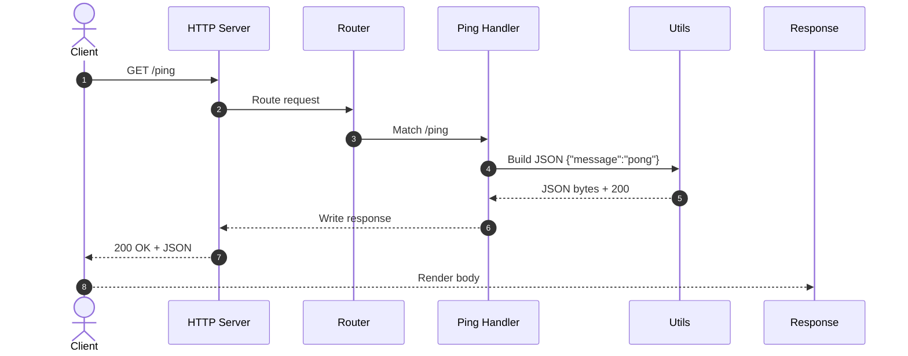
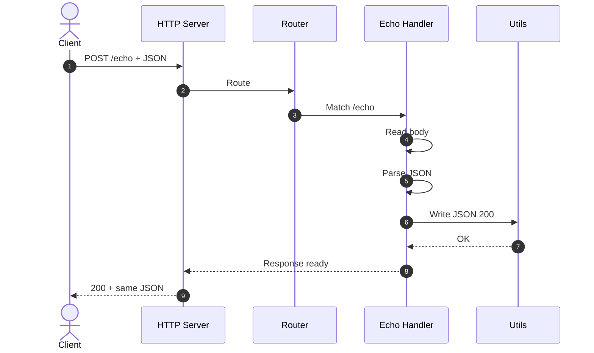

# Task 2 — HTTP Server

This task implements a small HTTP server in Go that listens on port 8080 and exposes two endpoints for quick integration checks. The goal is to demonstrate a clean request and response flow using JSON, along with a minimal set of helper functions collected under a `utils` package to keep handlers focused. The implementation passes the included unit tests and is wired to run successfully in GitHub Actions.

## What this service does

The server responds to a health-style probe at `/ping` with a JSON message indicating the service is reachable, and it echoes any JSON document posted to `/echo` back to the caller. The `utils` package centralizes common HTTP concerns such as writing JSON responses, applying headers, and uniform error payloads, which keeps the endpoint handlers concise and predictable. The end-to-end behavior matches the assessment’s expected outputs.

### GET Verb, `/ping` Endpoint

The HTTP verb GET is used by a client to request information from a server without modifying any data. It is safe and idempotent, meaning repeated calls should always return the same result without side effects. In this task, the /ping endpoint serves as a simple health check. When the client sends a GET request to /ping, the server responds with a lightweight JSON message {"message":"pong"}. 

This exchange confirms that the server is up, reachable, and able to process requests, making it a quick diagnostic tool before deeper interactions. 



### POST Verb, `/echo` Endpoint

The HTTP verb POST sends data from the client to the server to be processed. It is not idempotent and is typically used to create or submit content in the request body. In this task, the /echo endpoint accepts a JSON payload and returns the same JSON back to the caller. This confirms that the server can read the body, parse JSON, and write a correct JSON response, making it a simple round-trip integrity check before more complex interactions.



## Requirements

You need a recent Go toolchain (Go 1.22 or newer is sufficient). No external services are required to run or test this task locally. The repository already includes everything needed to run the server, its tests, and the GitHub Actions workflow that validates the build and tests in CI.

## How to run the server

From the repository root, start the server with a standard `go run` invocation pointing to the task’s main package. If the task is laid out as a package directory with a `main.go`, you can start it like this:

```
go run ./tasks/task2-httpserver
```

Once running, the server listens on `127.0.0.1:8080`.

## How to verify the endpoints

You can verify the `GET /ping` endpoint by calling it from another shell. A successful response returns a small JSON object with a message confirming liveness.

```
curl -s http://127.0.0.1:8080/ping
```

You can verify the `POST /echo` endpoint by posting any JSON body to it. The server returns the same payload in the response body, confirming the request parsing and JSON round trip.

```
curl -s -X POST http://127.0.0.1:8080/echo -H "Content-Type: application/json" -d '{"name":"test"}'
```

## About the utils package

The `utils` folder under `tasks/task2-httpserver/utils` contains the reusable building blocks the handlers depend on. These typically include helpers to marshal and write JSON with the correct content type, helpers to write errors in a consistent JSON format, and small conveniences for header management or input validation. By placing this logic in a separate package, the handlers for `/ping` and `/echo` remain straightforward and easy to read, while the utilities provide a single source of truth for response formatting.

## How to run the tests

From the repository root, run the task’s tests with the usual Go test command. If the tests are colocated with the task, you can run them as follows.

```
go test ./tasks/task2-httpserver/...
```

If a separate tests package is provided (for example, in a `task2-tests` directory), you can run that package similarly so long as its `go.mod` or imports target the task package correctly. The tests cover the normal success path for both endpoints and include JSON parsing and response assertions, ensuring the server returns the exact payload for `/echo` and the expected JSON shape for `/ping`.

## GitHub Actions

The repository includes a GitHub Actions workflow that builds and tests this task in CI. On every push or pull request, the workflow sets up Go, restores module dependencies, runs the unit tests, and reports the outcome. Because this task has no external runtime dependencies, the workflow executes quickly and deterministically.

## Sample responses

When the server is running, a call to `GET /ping` returns a JSON body with a `message` field set to `"pong"`. A call to `POST /echo` with a JSON document returns the same JSON document unchanged. These are the two observable behaviors expected by the assessment and verified by the tests and CI workflow.

## Conclusion

This task provides a compact, testable HTTP service with clear JSON semantics and a small `utils` package that consolidates HTTP concerns. The endpoints can be exercised locally with simple curl commands, and the automated tests alongside GitHub Actions ensure repeatable validation in continuous integration.
