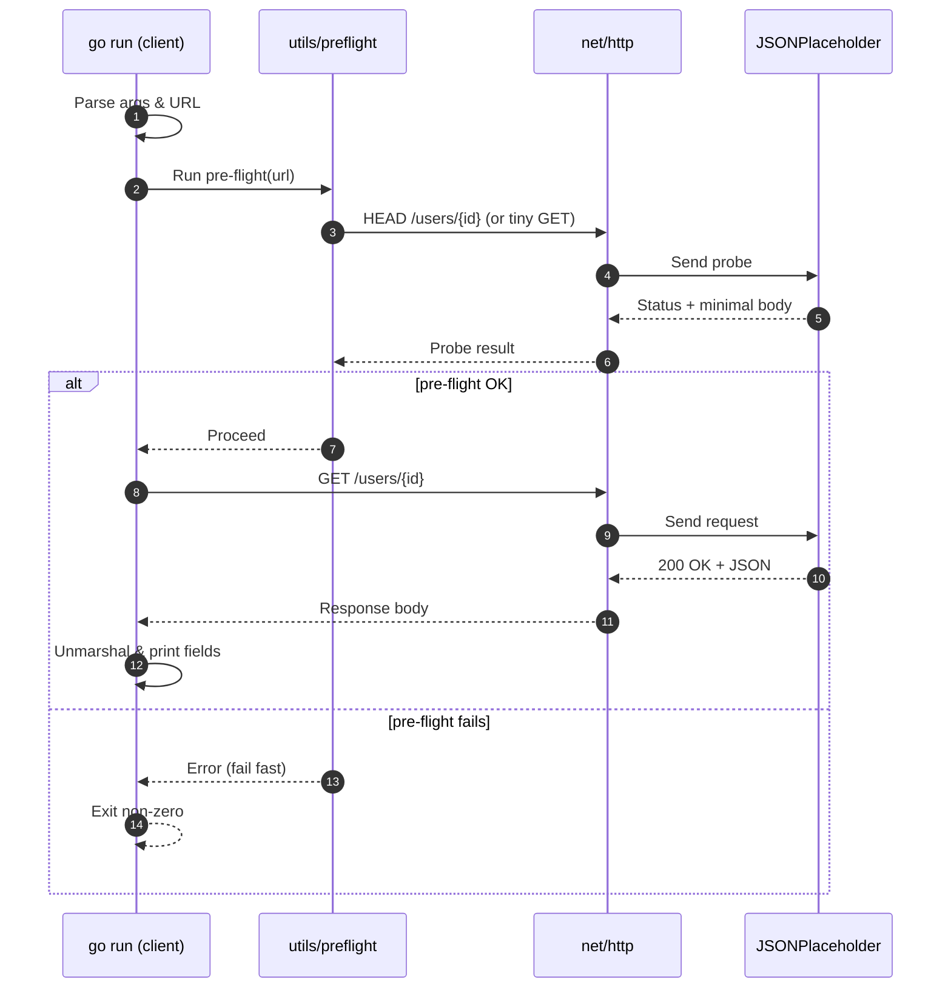

# Task 3 — REST API Client

This task implements a Go-based REST API client that interacts with the public [JSONPlaceholder](https://jsonplaceholder.typicode.com) service. The client fetches a user by ID, parses the JSON response, and prints key details to the console. The goal is to demonstrate Go’s `net/http` client usage, JSON unmarshalling, and structured output handling.

This project also includes test scripts written in Bash. The scripts start the client, execute requests against the JSONPlaceholder API, and compare the output against expected results. The tests are integrated into GitHub Actions for continuous validation.

Quick estimates for reading:

| Reading mode           | Estimate       |
| ---------------------- | -------------- |
| Fast skim              | \~3–6 minutes  |
| Typical technical read | \~6–10 minutes  |
| Careful read           | \~10–15 minutes |

## What this client does

The REST client requests user information from `https://jsonplaceholder.typicode.com/users/<id>`. It extracts specific fields from the JSON response—`id`, `email`, `phone`, and the `company` object—and prints them in a structured format. This confirms the ability to call external APIs, parse structured data, and format output.

The REST client builds an HTTP request to the JSONPlaceholder endpoint for a specific user ID, sends it over the network, receives a JSON response, unmarshals it into a Go struct, and prints the selected fields. Errors at any step are surfaced and cause a non-zero exit so tests and CI can detect failures.

In this exercise, we include a pre-flight sequence as a fast, fail-early check that runs before the “real” operation to prove that inputs are valid and the remote endpoint is reachable. In this task the client performs pre-flight to avoid wasting time on long requests or producing confusing downstream errors. 



The implementation validates the provided URL, constructs an HTTP client with conservative timeouts, and attempts a lightweight probe against the target (for example, a HEAD request or a minimal GET) so connectivity and basic server responsiveness are confirmed upfront. If any step fails—bad URL, DNS/transport error, or a non-successful status—the program exits early with a clear message; only on success does it proceed to fetch and unmarshal the full user payload.

## Requirements

* A recent Go toolchain (Go 1.22 or newer recommended).
* Internet connection (the client fetches data from the live JSONPlaceholder API).
* No additional services or configuration are required.

## How to run the client

From the repository root, run the client by specifying the package path and the user endpoint:

```bash
go run ./tasks/task3-restclient https://jsonplaceholder.typicode.com/users/2
```

### Expected Output

```json
{
  "id": 2,
  "email": "Shanna@melissa.tv",
  "phone": "010-692-6593 x09125",
  "company": {
    "name": "Deckow-Crist",
    "catchPhrase": "Proactive didactic contingency",
    "bs": "synergize scalable supply-chains"
  }
}
```

The program will fetch the user object, unmarshal the JSON, and print selected fields.

### About the code

The Go client defines a `User` struct that maps to the JSONPlaceholder user object. The code builds an HTTP request with `net/http`, reads the response body, unmarshals the JSON using `encoding/json`, and prints the relevant fields. Errors in request execution or parsing are handled gracefully.

## How to run the tests

The tests for this task are written as Bash scripts. They start the client, run it against the JSONPlaceholder API, capture the output, and compare it to expected JSON fragments. Any mismatch results in a non-zero exit code, which makes the tests suitable for local runs and GitHub Actions.

This approach keeps dependencies minimal, runs on any POSIX shell, and provides quick end-to-end verification.

**`task3_restclient_no_args.bash`** verifies argument handling when no URL is supplied. It invokes the client without parameters, expects an immediate non-zero exit, and checks that a short usage or error message is printed so users know they must pass an endpoint like `.../users/{id}`.

Run the tests locally with:

```bash
bash tests/task3_restclient_no_args.bash
```

```bash
ARGS: go run ./tasks/task3-restclient
PASS: no-args -> usage on stderr and exit 2.

usage: /Users/gcastill0/Library/Caches/go-build/52/52df4735acc48562b91c11c2d159140772bb94e4b33eeeb422772e52d432a7d3-d/task3-restclient <URL>
exit status 2
```

**`task3_restclient_invalid_url.bash`** checks URL validation and transport-level error handling. It runs the client with a malformed or unsupported URL, expects a non-zero exit, and confirms that the stderr output reports the URL issue (e.g., parse error or unsupported scheme) rather than attempting a request.

Run the tests locally with:

```bash
bash tests/task3_restclient_invalid_url.bash
```

```bash
ARGS: go run ./tasks/task3-restclient https://jsonplaceholder.typicode.coms/users/2
PASS: Preflight -> no such host on stderr and exit 3.

Preflight: Get "https://jsonplaceholder.typicode.coms/users/2": dial tcp: lookup jsonplaceholder.typicode.coms: no such host
exit status 3
```


**`task3_restclient_invalid_user.bash`** exercises application-level error handling against a syntactically valid endpoint that returns an error (such as a 404 for a non-existent user id). It expects a non-zero exit and a clear message indicating the HTTP status or that the user could not be found, proving the program distinguishes network failures from valid but unsuccessful API responses.

Run the tests locally with:

```bash
bash tests/task3_restclient_invalid_user.bash
```

```bash
ARGS: go run ./tasks/task3-restclient https://jsonplaceholder.typicode.com/users/999
PASS: Preflight -> Not Found and exit 3.

Preflight: preflight HEAD: 404 Not Found
exit status 3
```

**`ask3_restclient_valid_user.bash`** validates the happy path for a real user id (e.g., `/users/2`). It expects a zero exit code and captures stdout, asserting that the printed JSON includes the required fields (`id`, `email`, `phone`, and `company`). This confirms end-to-end success: request built, response received, JSON unmarshalled, and formatted output emitted.

Run the tests locally with:

```bash
bash tests/task3_restclient_valid_user.bash
```

```bash
ARGS: go run ./tasks/task3-restclient https://jsonplaceholder.typicode.com/users/2
PASS: Preflight -> 2 found and exit 0.

{
  "id": 2,
  "email": "Shanna@melissa.tv",
  "phone": "010-692-6593 x09125",
  "company": {
    "name": "Deckow-Crist",
    "catchPhrase": "Proactive didactic contingency",
    "bs": "synergize scalable supply-chains"
  }
}
```

## GitHub Actions

In this project, GitHub Actions is configured to run against the Go source directory so that every push or pull request automatically triggers a workflow. The workflow sets up Go, builds the client if required, and runs the Bash test scripts.

After a run completes, the summary page attached to the commit or pull request shows whether the tests passed, the steps executed, and the console output. This provides quick assurance that the client fetches and formats user data correctly.

## Task 2 HTTP Server — Test Summary

| Test | Result |
|------|--------|
| Empty URL | **PASS: no-args -> usage on stderr and exit 2.** |
| Invalid URL | **PASS: Preflight -> no such host on stderr and exit 3.** |
| Valid URL, invalid user | **PASS: Preflight -> Not Found and exit 3.** |
| Valid URL and user | **PASS: Preflight -> 2 found and exit 0.** |

<details><summary>Empty URL</summary>

```text
ARGS: go run ./tasks/task3-restclient
PASS: no-args -> usage on stderr and exit 2.

usage: /tmp/go-build2972088559/b001/exe/task3-restclient <URL>
exit status 2
```
</details>

<details><summary>Invalid URL</summary>

```text
ARGS: go run ./tasks/task3-restclient https://jsonplaceholder.typicode.coms/users/2
PASS: Preflight -> no such host on stderr and exit 3.

Preflight: Get "https://jsonplaceholder.typicode.coms/users/2": dial tcp: lookup jsonplaceholder.typicode.coms on 127.0.0.53:53: no such host
exit status 3
```
</details>

<details><summary>Valid URL, invalid user</summary>

```text
ARGS: go run ./tasks/task3-restclient https://jsonplaceholder.typicode.com/users/999
PASS: Preflight -> Not Found and exit 3.

Preflight: preflight HEAD: 404 Not Found
exit status 3
```

</details>

<details><summary>Valid URL and user</summary>

```text
ARGS: go run ./tasks/task3-restclient https://jsonplaceholder.typicode.com/users/2
PASS: Preflight -> 2 found and exit 0.

{
  "id": 2,
  "email": "Shanna@melissa.tv",
  "phone": "010-692-6593 x09125",
  "company": {
    "name": "Deckow-Crist",
    "catchPhrase": "Proactive didactic contingency",
    "bs": "synergize scalable supply-chains"
  }
}
```
</details>

## Conclusion

This task demonstrates how to build a Go HTTP client that integrates with a RESTful service, fetches and parses JSON, and prints structured results. The client can be run manually for quick exploration or validated with automated Bash scripts that ensure consistent behavior locally and in CI.

<br><br>

---

JSON Sample: Original author
Go Snippets: Original author
New Go Code: Apache License © 2025 G Castillo — see [LICENSE](/LICENSE).
This README and notes: CC BY 4.0 © 2025 G Castillo.
