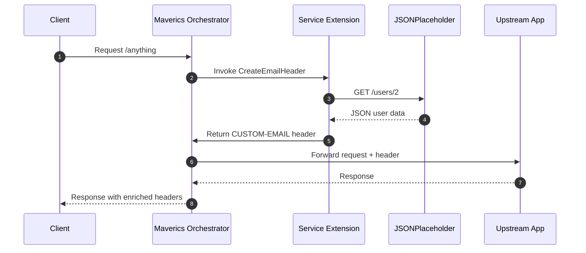
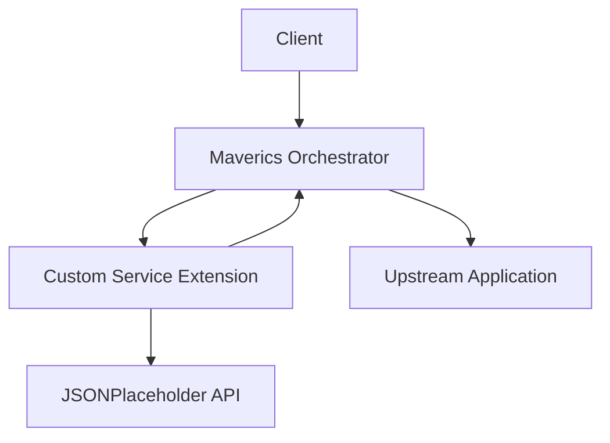

# Task 4 — Maverics Service Extension

This task extends the Maverics Orchestrator with a custom service extension. The extension fetches a user record from the JSONPlaceholder API, extracts the user’s email (for user ID 2), and injects that email address as a custom HTTP header (`CUSTOM-EMAIL`) into outbound requests.

The goal is to demonstrate how Go code can enrich an identity-aware orchestrator with custom logic while remaining testable and safe to run locally. This task builds on concepts from the previous exercises, combining API consumption, JSON parsing, and header creation.

Quick estimates for reading:

| Reading mode           | Estimate        |
| ---------------------- | --------------- |
| Fast skim              | \~4–6 minutes   |
| Typical technical read | \~6–10 minutes  |
| Careful read           | \~10–15 minutes |

For questions or feedback, please contact me using [this form](https://gcastill0.github.io/#contact).

<br>

## What this extension does

The service extension defines a function `CreateEmailHeader`. When invoked by the orchestrator, it queries JSONPlaceholder for user `id=2`, extracts the `email` field, and creates a custom header. Maverics then merges this header into the outbound request before forwarding it to the target application.

The result is an enriched request that carries identity data without modifying the target application itself.

---

### Shim (Development Harness)

A shim, or dev harness, is used to run and test the extension locally without needing the full orchestrator. It mimics the orchestrator’s call to `CreateEmailHeader`, allowing developers to test functionality in isolation.

In this project, the shim runs a lightweight HTTP server with a `/headers` endpoint. When called, it executes the extension, fetches the user from JSONPlaceholder, builds the custom header, and returns it in the response.

**Example:**

Terminal 1 – start the shim:

```bash
go run ./tasks/task3-restclient https://jsonplaceholder.typicode.com/users/2
```

Terminal 2 – test the extension:

```bash
curl -i http://127.0.0.1:8080/headers
```

Sample output:

```
HTTP/1.1 200 OK
Content-Type: application/json
Custom-Email: Shanna@melissa.tv
Date: Mon, 15 Sep 2025 17:21:32 GMT
Content-Length: 51

{"headers":{"CUSTOM-EMAIL":["Shanna@melissa.tv"]}}
```

This confirms the extension works before deploying into Maverics.

<br>

## Using the Maverics Orchestrator

When running in the full orchestrator, the extension is invoked during request enrichment. Maverics calls `CreateEmailHeader`, receives the custom header, merges it into the outbound request, and forwards the traffic.

Running the orchestrator locally:

```bash
./maverics_darwin_arm64 -config ./maverics.json
```

Invoking an endpoint through Maverics:

```bash
curl -ik https://127.0.0.1/anything
```

Sample upstream response showing the injected header:

```json
"headers": {
  "Accept": "*/*",
  "Accept-Encoding": "gzip",
  "Custom-Email": "Shanna@melissa.tv",
  "Host": "httpbin.org",
  "User-Agent": "curl/8.7.1"
}
```

<br>

## Sequence Diagram



<br>

## UML Component Diagram



This diagram shows the main components and their connections: the client sends traffic to Maverics, which delegates to the extension; the extension fetches data from JSONPlaceholder and returns headers; finally, Maverics forwards enriched requests to the upstream app.

<br>

## Conclusion

This task demonstrates how to extend a commercial orchestrator with custom Go logic. By using a shim, the extension can be tested locally before being deployed into Maverics. The orchestrator then integrates the extension into its enrichment phase, injecting the user’s email as a custom header into outbound requests.

This provides a safe and repeatable way to practice writing extensions, combining skills from earlier tasks into a real-world integration scenario.

<br><br>

---

JSON Sample: Original author<br>
Go Snippets: Original author<br>
New Go Code: Apache License © 2025 G Castillo — see [LICENSE](/LICENSE).
This README and notes: CC BY 4.0 © 2025 G Castillo.
