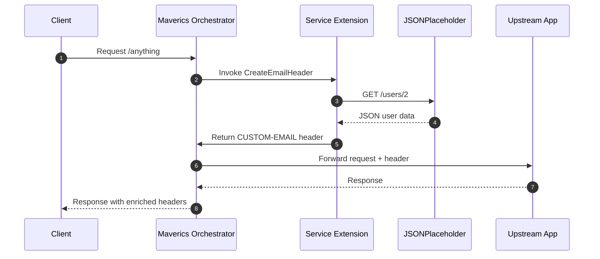
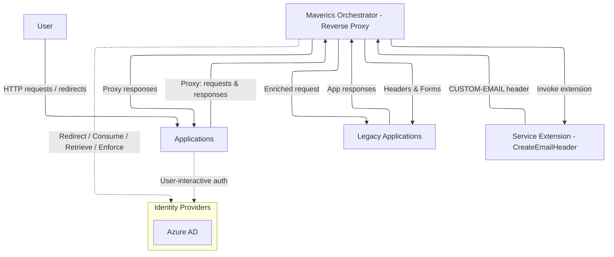

# Task 4 — Maverics Service Extension

This task extends the Maverics Orchestrator with a custom service extension. The extension fetches a user record from the JSONPlaceholder API, extracts the user’s email (for user ID 2), and injects that email address as a custom HTTP header (`CUSTOM-EMAIL`) into outbound requests.

The goal is to demonstrate how Go code can enrich an identity-aware orchestrator with custom logic while remaining testable and safe to run locally. This task builds on concepts from the previous exercises, combining API consumption, JSON parsing, and header creation.

Quick estimates for reading:

| Reading mode           | Estimate        |
| ---------------------- | --------------- |
| Fast skim              | \~4–6 minutes   |
| Typical technical read | \~6–10 minutes  |
| Careful read           | \~10–15 minutes |

For questions or feedback, please contact me using [this form](https://gcastill0.github.io/#contact).

<br>

## What this extension does

The service extension defines a function `CreateEmailHeader`. When invoked by the orchestrator, it queries JSONPlaceholder for user `id=2`, extracts the `email` field, and creates a custom header. Maverics then merges this header into the outbound request before forwarding it to the target application.

The result is an enriched request that carries identity data without modifying the target application itself.

---

### Shim (Development Harness)

A shim, or dev harness, is used to run and test the extension locally without needing the full orchestrator. It mimics the orchestrator’s call to `CreateEmailHeader`, allowing developers to test functionality in isolation.

In this project, the shim runs a lightweight HTTP server with a `/headers` endpoint. When called, it executes the extension, fetches the user from JSONPlaceholder, builds the custom header, and returns it in the response. The shim a lightweight stand-in that simulates how the service extension would behave inside the Maverics Orchestrator. 

It spins up a small local HTTP server with a single route (for example `/headers`), and when we call that route it directly invokes the extension function `CreateEmailHeader`. The extension then performs its normal logic—fetching the user from JSONPlaceholder, extracting the email, and building the `CUSTOM-EMAIL` header—before returning that header in the shim’s response.

It is important to note that the shim bypasses the orchestrator and upstream application, it is functional enough to validate the extension’s code path (API call, JSON parsing, header creation), but it does not enforce policy, manage sessions, or proxy traffic like the real Maverics service. In other words, the shim is a testing harness: it provides the same function calls and results we expect, but without the orchestration, security, and networking layers of the production system. This makes it excellent for quick, local iteration, while acknowledging it is not a true replacement for the orchestrator.


**Example:**

Terminal 1 – start the shim:

```bash
go run ./tasks/task3-restclient https://jsonplaceholder.typicode.com/users/2
```

Terminal 2 – test the extension:

```bash
curl -i http://127.0.0.1:8080/headers
```

Sample output:

```
HTTP/1.1 200 OK
Content-Type: application/json
Custom-Email: Shanna@melissa.tv
Date: Mon, 15 Sep 2025 17:21:32 GMT
Content-Length: 51

{"headers":{"CUSTOM-EMAIL":["Shanna@melissa.tv"]}}
```

This confirms the extension works before deploying into Maverics. 

The shim employs a complex import and assignment process to simulate the real orchestrator API instance, as the extension’s entry point is defined by the interfaces of that package (such as logger, session, context, etc.) rather than using ad-hoc structs. Through this exercise, I learned that in Go, an object must match the exact method set of an interface at compile time; therefore, a plain struct cannot be utilized—there must be a fake that implements the same interfaces as the actual orchestrator.


 
To create this, the shim imports the orchestrator package, uses type aliases when beneficial, and establishes stub implementations for logger and session, typically through small wrapper structs that meet the required methods while returning controlled, deterministic values. These stubs are assigned to an interface variable (for example, `var api orchestrator.Orchestrator = &fakeOrchestrator{...}`), allowing for the function `CreateEmailHeader(api, w, r)` to execute through the same code path as in a production environment from the function’s perspective.
 
This setup avoids the necessity of including the complete orchestrator runtime, along with its configuration and network side effects, while safeguarding against compile-time discrepancies. If the real interfaces are altered, the shim will produce an immediate build-time error instead of leading to silent divergence. Additionally, it prevents nil-pointer panics by ensuring that every method called by the extension (e.g., Logger(), Session()) returns a valid stub object. The result is a functional but non-production environment where the extension’s logic—such as HTTP fetching, JSON parsing, and header creation—can be tested using the same types and method signatures as the real system, without involving policy engines, TLS endpoints, or licensing issues.

<br>

## Using the Maverics Orchestrator

When running in the full orchestrator, the extension is invoked during request enrichment. Maverics calls `CreateEmailHeader`, receives the custom header, merges it into the outbound request, and forwards the traffic.

Running the orchestrator locally:

```bash
./maverics_darwin_arm64 -config ./maverics.json
```

Invoking an endpoint through Maverics:

```bash
curl -ik https://127.0.0.1/anything
```

Sample upstream response showing the injected header:

```json
"headers": {
  "Accept": "*/*",
  "Accept-Encoding": "gzip",
  "Custom-Email": "Shanna@melissa.tv",
  "Host": "httpbin.org",
  "User-Agent": "curl/8.7.1"
}
```

<br>

This diagram shows the main components and their connections: the client sends traffic to Maverics, which delegates to the extension; the extension fetches data from JSONPlaceholder and returns headers; finally, Maverics forwards enriched requests to the upstream app.



### Challenges

During the effort to validate the **CreateEmailHeader** Service Extension in Maverics, the main challenge has been that although the extension executes successfully in isolation, the **`CUSTOM-EMAIL`** header does not appear in the proxied request responses. Every test request consistently returns a **200 OK** status, which confirms that routing, upstream connectivity, and policy evaluation are functioning. However, the expected custom header is not visible in the response.

A series of checks and adjustments have already been made:

* Verified the Go code compiles and runs correctly outside Maverics.
* Confirmed the Service Extension is loaded into the bundle (present in `serviceExtensionMetadata`).
* Adjusted the app’s `routePatterns` (`/`, `/*`, `/json/*`) and validated the correct request path with `curl`.
* Ensured `preserveHost: false` so that upstreams see the expected host header.
* Pointed upstream to `httpbin.org` to visualize headers.
* Confirmed policies are applied (`matched policy ... policy=/` observed in logs).
* Moved header attachment from the app level into the matching policy block.
* Tested both unauthenticated pass-through and policy-scoped Service Extension execution.
* Reviewed log output to confirm requests are routed correctly and consistently return **200 OK**.

At this point, the configuration and code paths appear correct, and all major failure scenarios have been ruled out. The issue is most likely due to a small and trivial mis-scoping detail—for example, a mismatch between the policy `location` and the request path, or how the Service Extension is referenced inside the policy.

<br>

## Conclusion

This task demonstrates how to extend a commercial orchestrator with custom Go logic. By using a shim, the extension can be tested locally before being deployed into Maverics. The orchestrator then integrates the extension into its enrichment phase, injecting the user’s email as a custom header into outbound requests.

This provides a safe and repeatable way to practice writing extensions, combining skills from earlier tasks into a real-world integration scenario.

<br><br>

---

JSON Sample: Original author<br>
Go Snippets: Original author<br>
New Go Code: Apache License © 2025 G Castillo — see [LICENSE](/LICENSE).
This README and notes: CC BY 4.0 © 2025 G Castillo.
